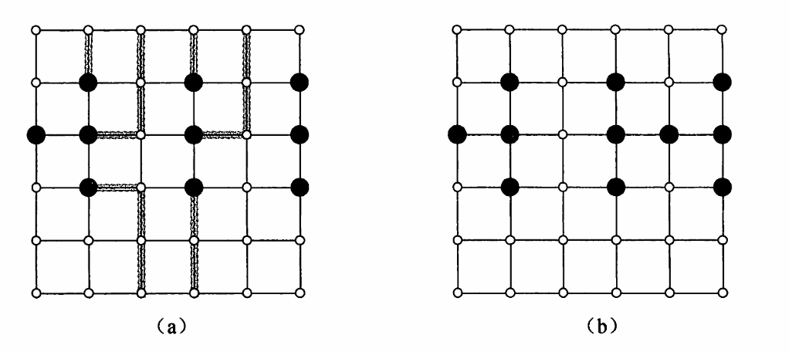

26－1（逃逸问题）$n \times n$ 的网格是由 $n$ 行和 $n$ 列结点所构成的无向图，如图 26－11 所示。我们将位于第 $i$ 行和第 $j$ 列的结点表示为 $(i, j)$ 。除了位于边界的结点外，网络中其他所有结点都有刚好 4 个邻结点。边界结点指的是满足 $i=1 、 i=n 、 j=1$ 或 $j=n$ 的结点 $(i, j)$ 。
在这样的网格里给定 $m \leqslant n^2$ 个起始结点 $\left(x_1, y_1\right),\left(x_2, y_2\right), \cdots,\left(x_m, y_m\right)$ ，逃逸问题要做的事情是判断是否存在从这些起始结点到任意 $m$ 个不同的边界结点之间的 $m$ 条结点分离的路径（每条路径之间没有共同结点）。例如，在图 26－11（a）所示的网格中有一个逃逸线路，但图 26－11（b）的网格则没有逃逸线路。

图 26－11 用于逃逸问题的网格。黑色的点为起始结点，其他结点为白色。（a）有逃逸线路的网格，逃逸线路上都加了阴影。（b）没有逃逸线路的网格
a．考虑一个结点和边都有容量限制的流网络。也就是说，进人任何给定结点的正流都要受到容量的限制。证明：在一个结点和边都有容量的流网络中确定最大流的问题可以归约为同等规模流网络中的普通最大流问题。

b．给出一个有效的算法来解决逃逸问题，并分析算法的运行时间。

---

a.

对每个结点进行“点拆分”如下：

1. 对流网络中的每个结点 $v$ 拆分为两个结点 $v_{\mathrm{in}}$ 和 $v_{\mathrm{out}}$，并用一条容量为 $c(v)$（即原结点的容量）的有向边从 $v_{\mathrm{in}}$ 指向 $v_{\mathrm{out}}$。  
2. 对于流网络中原先每条从 $u$ 指向 $w$ 的有向边（容量为 $c(u,w)$），在拆分后的网络中改为从 $u_{\mathrm{out}}$ 指向 $w_{\mathrm{in}}$ 的有向边，且容量仍为 $c(u,w)$。  

这样一来，每个原结点的容量限制就被转化为拆分后的一条“中间边”的容量限制；原来的边容量也保持在拆分后网络的边上。由此可见，任何在带有节点容量限制的流网络上求得的最大流，都可以在等规模（顶点数和边数在同一数量级）但仅含边容量限制的网络中求得，从而完成归约。

b.

构建这样一个流网络：

1. 初始网络共$n \times n$个结点，每个结点与逃逸问题网格中的一个结点一一对应。不妨设逃逸问题网格中结点$v_i$对应网络中结点$u_i$。每个结点具有容量限制$c(u_i)=1$。
2. 对每一对逃逸问题网格中相邻的结点对$(v_i,v_j)$，在流网络中新增边$(u_i,u_j)$，容量限制$c(u_i,u_j)=1$。注意，对给定的$v_i,v_j$，这里认为$(v_i,v_j)$和$(v_j,v_i)$是不同的结点对，从而保证完成网络中有向边的初始化。
3. 在流网络中新增一个源点$s$，容量限制$c(s)=+\infty$，对于逃逸问题网格中的起始结点$v_1, v_2, \dots, v_m$，在流网络中新增边$(s, u_1), (s, u_2), \dots, (s, u_m)$，容量限制$c(s, u_1)=c(s, u_2)=\dots=c(s, u_m)=1$。
4. 在流网络中新增一个汇点$t$，容量限制$c(t)=+\infty$。对于逃逸问题网格中的边界结点$v_1', v_2', \dots, v_{4n-4}'$，在流网络中新增边$(u_1', t), (u_2', t), \dots, (u_{4n-4}', t')$，容量限制$c(u_1', t)=c(u_2', t)=\dots=c(u_{4n-4}',t)=1$。

在这个流网络中寻找最大流，如果最大流的值等于起始节点数量，那么有逃逸线路，否则没有。

算法复杂度分析：

1. 网络构建过程复杂度$O(n^2)$。
2. 结点拆分转换成普通最大流问题过程复杂度$O(n^2)$。
3. 求解最大流问题过程，结点数$V=O(n^2)$，边数$E=O(n^2)$，如果使用Dinic算法求解最大流问题，那么复杂度$O(V^2E)=O(n^6)$。